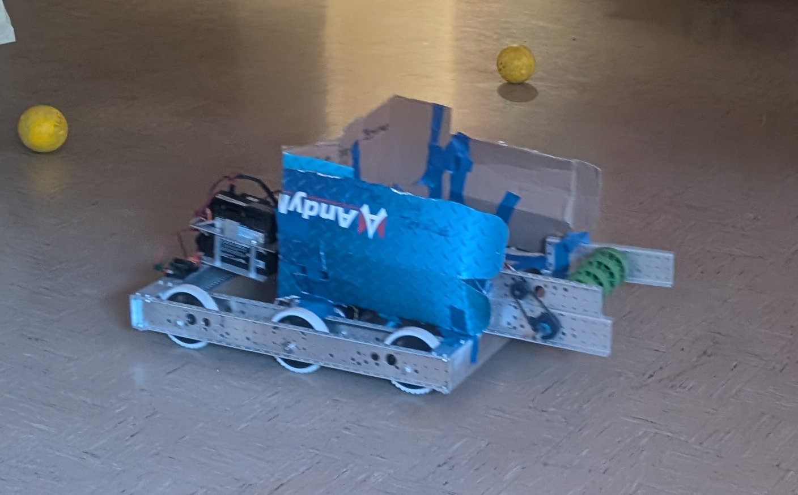
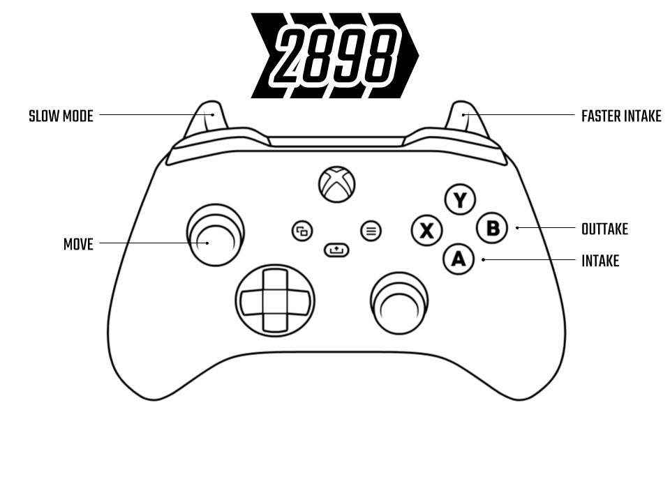

# Spark Academy Week 2 Tank Robot

This robot was assembled by [Spark Academy](https://bpsrobotics.org/spark/index.html)
students by putting an intake on a Tank drivebase we already had lying around.

## Buttons

